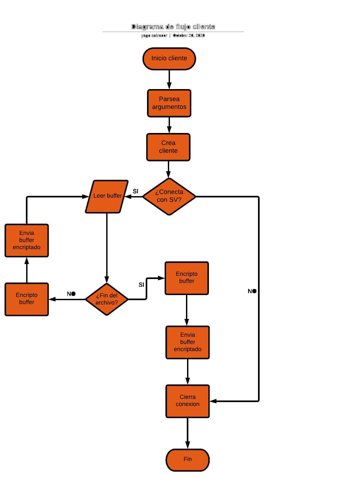
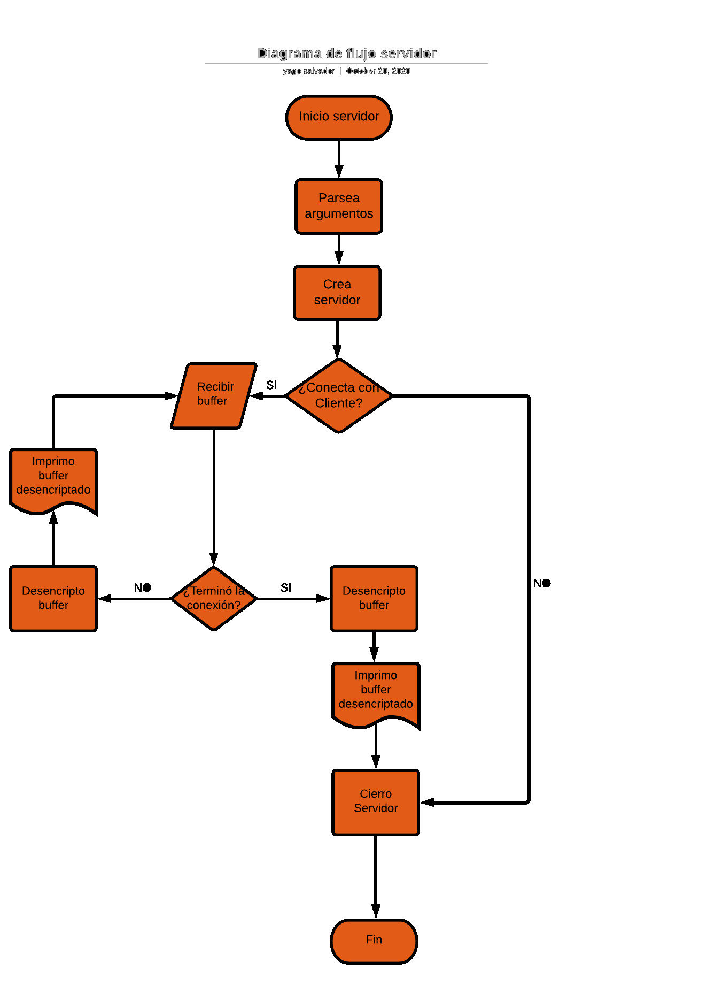

# tp1
Nombre: Yago Salvador
Url: https://github.com/yagosalvador/tp1.git

Taller de Programación FIUBA Trabajo Práctico N1: Crypto-Sockets

----------------------
## 1. Introducción
En el presente informe se intentará detallar la implementación del programa desarrollado. El mismo consta de el desarrollo de una aplicación cliente-servidor donde el cliente recibe una cadena por *stdin*, la encripta y envía al servidor. Por su parte, el servidor se encarga de recibir la cadena encriptada, desencriptarla e imprimir la misma por *stdout*. Al ejecutar tanto el cliente como el servidor se debe indicar que método se usará para encriptar y la *key* correspondiente para el mismo.

## 2. Desarrollo

### 1. Diagramas de flujo

Con el fin de facilitar el funcionamiento del programa se desarrollaron los diagramas de flujo correspondientes de cada implicado.





### 2. Detalles de implementación

Se optó por desarrollar un TDA *Cypher* que funciona principalmente como una interfaz. En la misma se encuentra la función de inicialización donde se define el método para encriptar y luego se corre el mismo llamando a la función digest. 

#### 1. TDA Cypher
```C
typedef struct cypher {
	bool decrypt;
	unsigned char key[SIZE];
	size_t key_length;
	size_t i, j;
	cypher_func_t func;
} cypher_t;

int cypher_init(cypher_t * cypher, bool decrypt, 
			    const char * key, const char * method_str);
```

Esta última delega el proceso de encriptación al método elegido previamente mediante un puntero a función. 

```C
int cypher_digest(cypher_t * cypher, const unsigned char * string, 
			      unsigned char * output, const size_t len){
	int ret = cypher->func(cypher, string, output, len);
	if ( ret != 0 )
		return ret;

	return 0;
}
```

#### 2. TDA Buffer

Con el fin de encapsular la lectura de datos de archivos y que el cliente no se encargue de esta, se implementó un TDA Buffer.

```C
typedef struct{
	char buff[BUFF_SIZE];
	size_t buff_size;
	size_t buff_len;
	bool eof;
} buffer_t;
```
El TDA consta de funciones simples de inicialización del TDA, lectura de archivos al buffer, verificación de End-Of-File y obtención de una copia del buffer.

```C
int buffer_init(buffer_t * buffer);

int buffer_read(FILE * file, buffer_t * buffer);

bool buffer_eof(const buffer_t buffer);

int buffer_get(const buffer_t buffer, char * output, size_t len);
```

### 3. Type Status y Error

Se destaca el uso del tipo *status_t* con el objetivo de hacer el programa *user friendly* para que el usuario pueda apreciar donde se dieron los errores en el programa. 

```C
typedef enum {
	OK = 0,
	.
	.
	.
	ERROR_ARGS = 19
} status_t;
```

Si bien *status_t* es un simple enum que define un valor para cada error, se creó una función *print_error* que se encarga de recibir el error, tomar el valor del mismo y al revisar el diccionario de errores, imprimir el mensaje correspondiente.

```C
void print_error(FILE * file, status_t status);
```
